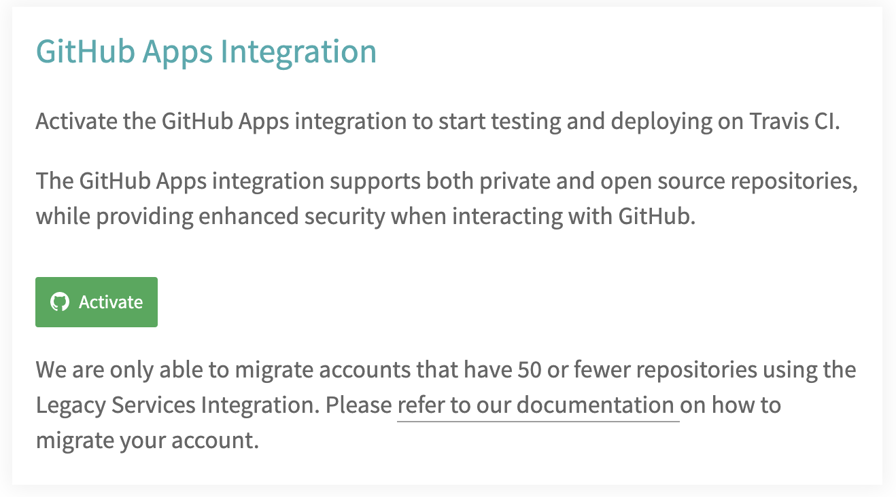
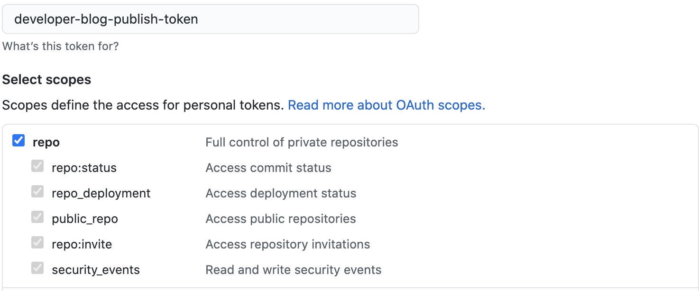
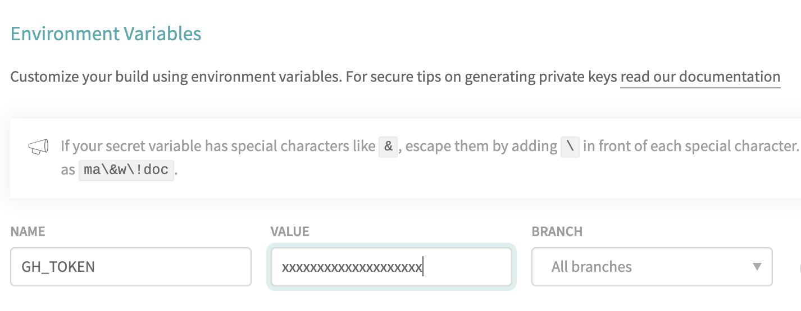

## How to use this

This repository is built using `gatsby` and allows you to publish by writing in `Markdown`. You can fork this repository to your own github account and get started.

You want to look at the following:
- `config/metadata.js` to customise various setting with respect to your profile like `name`, `description`, `email` etc.
- `config/settings.js` to set the number of posts visible on your index page.
- `static/resume.pdf` - replace this file with your own updated CV to let users download
- `src/assets/images/headshot.jpg` - replace this with a JPEG file.
- `src/assets/images/icon.png` - replace this to change the favicon of your website.

## To automate deployment using TravisCI

Sign up for an account on [TravisCI](https://travis-ci.com/signup) using `Signup with Github`. Activate GitHub Apps Integration.



Select to either allow integration on all repositories or just this one respository.


Gatsby publishes the static website in the directory `public/`, which has to be published to `gh-pages` branch in order to have it accessible using the `<username>.github.io`

#### Step 1: Obtain a github token
To push changes from the TravisCI to GitHub pages, you need to authenticate.

In GitHub, go to your [Personal access tokens](https://github.com/settings/tokens)
```
Account settings -> Developer settings -> Personal access tokens
```
and create a new token that provides the repo access permissions.



#### Step 2: Updated TravisCI

In the Travis configuration, for the repository add a new secret environment variable of the name `GH_TOKEN` with the value of the token obtained from GitHub. Make sure you DO NOT toggle the display in build logs setting as the token is best to remain secret. Otherwise, others are able to push to your repository.



## Start writing
You can now start writing your posts in Markdown, commit and push to master. The CI will take care of publishing to `gh-pages` which will in turn update your website.

```
|-src
  |--posts
     |-- post01
         |--post.md
```

You can place your post assets like images under the folder.

Have a look at the sample posts to understand how to set the `title`, `url`, `date` etc. for your post. This tempate uses `prismjs` to highlight code. So you can surround your code snippets with triple backticks (`) and append the language to select formatting eg.
````
```js
console.log('hello world');
```
````
will result in
```js
console.log('hello world');
```


## For curious developers.
To develop with the framework.
```bash
> npm install
> gatsby develop
```

## TODO
- Implement themeing using the `settings.js` file.


## Credits

- Includes sample headshot : <span>Photo by <a href="https://unsplash.com/@milkbox?utm_source=unsplash&amp;utm_medium=referral&amp;utm_content=creditCopyText">Ryan Kwok</a> on <a href="https://unsplash.com/s/photos/professional-headshot?utm_source=unsplash&amp;utm_medium=referral&amp;utm_content=creditCopyText">Unsplash</a></span>


## 💫 Deploy

[](https://app.netlify.com/start/deploy?repository=https://github.com/jagzviruz/developer-blog)

[](https://vercel.com/import/project?template=https://github.com/jagzviruz/developer-blog)

<!-- AUTO-GENERATED-CONTENT:END -->
